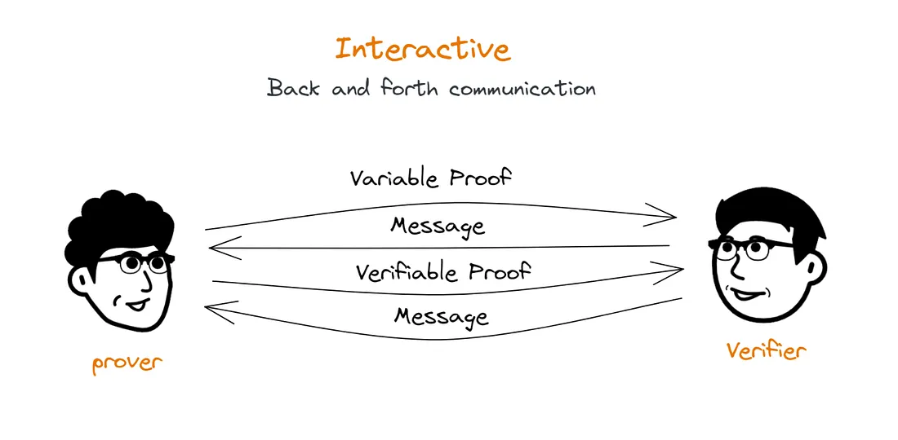
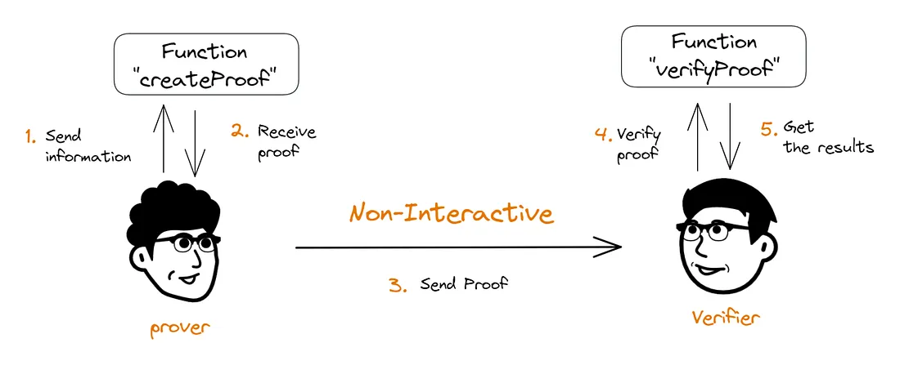

## Fiat-Shamir heuristic Protocol

### Introduction
A cryptographic protocol is a distributed algorithm describing precisely the interactions between two or more entities, achieving certain security objectives.

There are basically two forms of authentication schemes: interactive authentication schemes (e.g., identification schemes) and noninteractive authentication schemes (e.g., digital signature schemes). Likewise, one may distinguish two forms of zero-knowledge proof schemes: interactive proof schemes and noninteractive proof schemes. 

An interactive proof scheme involves a protocol where a prover convinces a verifier of a statement's truth.

Figure 1: Interactive zero-knowledge proofs (Momin, 2023)

A noninteractive proof scheme includes algorithms for a prover to generate a proof and a verifier to verify it, ensuring confidentiality. The prover proves knowledge of a secret to the verifier without disclosing it, ensuring that the verifier only learns whether the prover has the secret or not.

Figure 2: Non-interactive zero-knowledge proofs (Momin, K. 2023)

A unique feature of a noninteractive Σ-proof is its ability for any entity to act as the verifier. This means that multiple entities can independently verify the proof, similar to how anyone interested in its validity can verify a digital signature.

The Fiat–Shamir heuristic simplifies Σ-protocols into noninteractive forms, enabling practical zero-knowledge identification.

### Overview
In the Fiat-Shamir protocol, a trusted third party chooses two large prime
numbers `p` and `q` to calculate the value of `n = p × q`. The value of `n` is disclosed to the public while the values of `p` and `q` are kept secret. Alice the prover, selects a secret number `s` between 1 and n-1 i.e., `(1 ≤ s <n)`. She calculates `v = s mod n`. She keeps `s` as her private key and registers `v` as her public key with the third party. 

Verification of Alice by Bob can be done in four steps shown below:
1. Alice, the claimant, chooses a random number `r` between 0 and n-1 i.e., `(1 ≤ r <n)`. She then calculates the value of `x = r² mod n`; `x` is called as witness.
2. Alice sends `x` to Bob as the witness.
3. Bob the verifier, sends a challenge `c` to Alice, `c` is either 0 or 1.
4. Alice calculates the response <code>rsc</code>, where `r` is a random number selected by Alice in the first step. `s` is her private key and `c` is the challenge(0 or 1).
5. Alice sends the response to Bob to show that she knows value of her private
key, s. She claims to be Alice.
6. Bob calculates <code>xvc</code>. If these two values are equal then Alice
either knows the value of s (she is honest) or she has calculated the value of
`y` in some other way (dishonest) because we can easily prove that y² is the same as xvc in the modulo n arithmetic as given below:
<code>
y² = (rs)c = r²s²c = r²(s²)c = xvc
</code>

 

### Summary (Suitability of Fiat-Shamir Hash Functions in Various Protocols)
Fiat Shamir is sound when using  a Random Oracle model (and ZK for some suitable definitions) but totally broken using any instantiation. It sometimes require a cryptographic hash function. For certain protocols such as Lyubashevsky, Schnorr, Chaum-Pedersen simple FS hash functions can be enough. But for many classic protocols such as GMR85, Blum86 and GMW86 cryptographic FS hash functions are imperative.

### References
1. Schoenmakers, B. (2024, February 2). Lecture Notes Cryptographic Protocols. https://www.win.tue.nl/~berry/CryptographicProtocols/LectureNotes.pdf.

2. U. Feige, A. Fiat, and A. Shamir. Zero-knowledge proofs of identity. Journal of Cryptology, 1(2):77–94, 1988.

3. Maurya, Amit & Choudhary, Murari & P, Ajeyaraj & Singh, Sanjay. (2012). Modeling and Verification of Fiat-Shamir Zero Knowledge Authentication Protocol. 10.1007/978-3-642-27308-7_6.

4. Forouzan, B.A.: Cryptography & Network Security. First edn. McGraw-Hill Press, 
United Kingdom (2008)

5. Momin, K. (2023, April 4). A Non-Mathematical introduction to zero knowledge proof. Medium. Retrieved March 27, 2024, from https://kayprasla.medium.com/a-non-mathematical-introduction-to-zero-knowledge-proof-c1a4a269e308

6. Wikipedia contributors. (2024, February 29). Random oracle. Wikipedia. https://en.wikipedia.org/wiki/Random_oracle